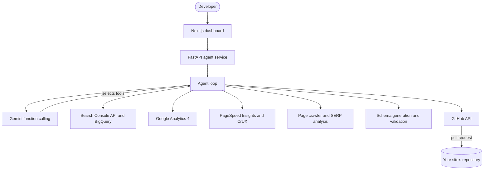

# NebulaSEO

NebulaSEO is an autonomous SEO agent. It reads your site's Search Console and Analytics
data, audits live pages for Core Web Vitals and structured data problems, and then opens
pull requests against your repository that fix the meta tags, JSON-LD schema, and heading
structure it found wrong.

The agent runs on Gemini with 50 function-calling tools and is driven either through a
chat interface, a scheduled automation run, or the HTTP API. It ships as two services: a
FastAPI backend and a Next.js dashboard.

[](https://github.com/Vmnebula/NebulaSeo/actions/workflows/ci.yml)
[](LICENSE)
[](agent/requirements.txt)
[](dashboard/package.json)

## Contents

- [How it works](#how-it-works)
- [Quick start](#quick-start)
- [Configuration](#configuration)
- [Agent tools](#agent-tools)
- [Autonomous pull requests](#autonomous-pull-requests)
- [HTTP API](#http-api)
- [Architecture](#architecture)
- [Development](#development)
- [Project layout](#project-layout)
- [Contributing](#contributing)
- [Security](#security)
- [License](#license)

## How it works

Most SEO tooling reports problems and stops there. NebulaSEO closes the loop: the same
agent that identifies a missing canonical tag or a broken heading hierarchy also edits
the file in your repository and opens a pull request, so the fix arrives as a reviewable
diff rather than a task in a backlog.

Three things happen on a run:

1. **Measure.** Pull Search Console and GA4 metrics, run PageSpeed Insights, crawl the
   page, and validate its structured data.
2. **Decide.** The model chooses which tools to call based on what the data shows, rather
   than following a fixed script.
3. **Fix.** Where a code change is warranted, the agent branches, commits, and opens a
   pull request. Nothing merges on its own.

## Quick start

You need a Gemini API key and, for the pull request tools, a GitHub token. Everything
else is optional.

### With Docker Compose

```bash
git clone https://github.com/Vmnebula/NebulaSeo.git
cd NebulaSeo

cp .env.example .env
# Edit .env: set GEMINI_API_KEY, and GITHUB_TOKEN plus GITHUB_REPO if you want
# the agent to open pull requests.

docker compose up --build
```

| Service | URL |
| --- | --- |
| Dashboard | <http://localhost:3000> |
| Agent API | <http://localhost:8080> |
| API reference | <http://localhost:8080/docs> |

### Without Docker

Run the agent:

```bash
cd agent
python3 -m venv venv
source venv/bin/activate
pip install -r requirements.txt

cp ../.env.example ../.env   # then edit it
python main.py
```

And the dashboard, in a second terminal:

```bash
cd dashboard
npm ci
npm run dev
```

The dashboard requires [Clerk](https://clerk.com) keys for sign-in. Set
`NEXT_PUBLIC_CLERK_PUBLISHABLE_KEY` and `CLERK_SECRET_KEY` in `.env` before starting it.

## Configuration

All settings are read from the environment. `.env.example` documents every variable;
`docker compose` loads `.env` for both services.

| Variable | Required | Description |
| --- | --- | --- |
| `GEMINI_API_KEY` | yes, in Gemini API mode | Key from [AI Studio](https://aistudio.google.com/apikey). |
| `GOOGLE_GENAI_USE_VERTEXAI` | no | `False` to use the Gemini API, `True` to use Vertex AI. Defaults to `True` in the agent and is set to `False` by `docker-compose.yml`. |
| `GOOGLE_CLOUD_PROJECT` | yes, in Vertex mode | Project used for Vertex AI and BigQuery. Requires application default credentials. |
| `TARGET_SITE_URL` | yes | The site the agent audits. |
| `GSC_SITE_URL` | for Search Console tools | Property identifier, for example `sc-domain:example.com`. |
| `GITHUB_TOKEN` | for pull request tools | Token with Contents and Pull requests write access. |
| `GITHUB_REPO` | for pull request tools | Repository in `owner/name` form. |
| `AGENT_TOKEN` | recommended | Shared secret for `/chat` and `/automate`. **If unset, those endpoints accept unauthenticated requests.** |
| `GA4_PROPERTY_ID` | for Analytics tools | Numeric GA4 property id. |
| `GOOGLE_PSI_API_KEY` | no | Raises the PageSpeed Insights rate limit. |
| `GOOGLE_CUSTOM_SEARCH_API_KEY`, `GOOGLE_CUSTOM_SEARCH_CX` | for SERP tools | Programmable Search credentials. |
| `NEXT_PUBLIC_CLERK_PUBLISHABLE_KEY`, `CLERK_SECRET_KEY` | for the dashboard | Clerk authentication keys. |
| `NEXT_PUBLIC_AGENT_URL` | no | Agent URL as reached from the browser. |
| `AGENT_INTERNAL_URL` | no | Agent URL as reached from the dashboard container. |

Tools whose credentials are absent report that they are unconfigured instead of failing
the run, so you can start with Gemini alone and add data sources as you go.

## Agent tools

The agent exposes 50 tools. Gemini selects among them per turn.

**Search Console, live API** — `gsc_live_keywords`, `gsc_live_pages`,
`gsc_live_keyword_pages`, `gsc_live_daily_trend`, `gsc_live_device_breakdown`,
`gsc_live_country_breakdown`

**Search Console, BigQuery bulk export** — `get_gsc_performance`, `get_top_keywords`,
`get_page_performance`, `get_device_breakdown`, `get_country_performance`,
`analyze_keyword_drops`, `get_data_source_status`

**Google Analytics 4** — `get_traffic_overview`, `get_top_pages_analytics`,
`get_traffic_sources`, `get_organic_landing_pages`, `get_realtime_users`

**Performance and Core Web Vitals** — `pagespeed_audit`, `pagespeed_compare`,
`core_web_vitals`, `run_technical_audit`

**Crawling and competitive analysis** — `fetch_page_content`, `crawl_sitemap`,
`analyze_competitor`, `analyze_serp`, `suggest_title_improvements`

**Structured data** — `generate_schema_markup`, `validate_schema_json`,
`validate_schema_on_page`

**Content generation** — `generate_meta_title`, `generate_meta_description`,
`generate_blog_outline`, `generate_blog_content`, `generate_alt_text`

**Indexing** — `request_indexing`, `batch_indexing`, `sitemap_ping`,
`get_indexing_status`

**GitHub** — `github_list_files`, `github_read_file`, `github_create_branch`,
`github_update_file`, `github_create_pr`, `github_list_prs`, `github_get_repo_info`

**Autonomous fixes** — `fix_meta_tags`, `add_schema_markup`, `fix_heading_structure`,
`create_blog_post`. Each of these audits a page, edits the source file, and opens a
pull request in one call.

## Autonomous pull requests

When the agent decides a page needs a code change it:

1. Crawls the live URL and compares it against the audit rules.
2. Locates the corresponding source file through the GitHub API.
3. Applies a targeted edit to that file's markup.
4. Creates a branch, commits the change, and opens a pull request describing what it
   changed and why.

The agent never pushes to your default branch and never merges. Review the diff as you
would any contribution. Scope the `GITHUB_TOKEN` to the single repository you want it to
touch.

## HTTP API

| Method | Path | Auth | Description |
| --- | --- | --- | --- |
| `GET` | `/` | none | Service metadata and configured data sources. |
| `GET` | `/health` | none | Health check. |
| `POST` | `/chat` | `AGENT_TOKEN` | Send a prompt; the agent replies after calling whatever tools it needs. |
| `POST` | `/automate` | `AGENT_TOKEN` | Run the full detect, analyse, fix, and index pipeline. |
| `GET` | `/automate/history` | none | Results of recent automation runs. |
| `GET` | `/automate/status` | none | Whether a run is in progress. |
| `GET` | `/logs` | none | Recent agent activity, filterable by type and status. |

Authenticated endpoints accept either `Authorization: Bearer <token>` or
`X-Agent-Token: <token>`.

```bash
curl -X POST http://localhost:8080/chat \
  -H "Authorization: Bearer $AGENT_TOKEN" \
  -H "Content-Type: application/json" \
  -d '{"message": "Audit /pricing and open a PR for anything broken"}'
```

## Architecture



## Development

```bash
# Agent
cd agent
pip install -r requirements.txt
pip install pytest ruff
python -m pytest
ruff check ..

# Dashboard
cd dashboard
npm ci
npm run lint
npm run build
```

CI runs the agent test suite on Python 3.11 through 3.13, lints the agent with ruff,
lints and builds the dashboard, and builds both Docker images. Ruff rules live in
`pyproject.toml`.

## Project layout

```
agent/
  main.py              FastAPI application and endpoint definitions
  src/agent.py         Agent loop and the 50 tool declarations
  src/tools/           One module per tool group
    gsc_api_tool.py      Search Console live API
    gsc_tool.py          Search Console via BigQuery
    bigquery_tool.py     BigQuery queries and drop analysis
    analytics_tool.py    Google Analytics 4
    pagespeed_tool.py    PageSpeed Insights and Core Web Vitals
    web_crawler.py       Page fetching and parsing
    serp_analyzer.py     SERP and competitor analysis
    schema_validator_tool.py  JSON-LD validation
    content_generator.py Meta tags, outlines, and copy
    indexing_tool.py     Indexing API and sitemap pings
    github_tool.py       GitHub reads, commits, and pull requests
    seo_actions.py       Audit-and-fix flows that produce pull requests
    automation.py        Scheduled end-to-end pipeline
  tests/               Test suite
dashboard/             Next.js 14 App Router dashboard
docker-compose.yml     Both services for local use
cloudbuild.yaml        Google Cloud Build deployment
```

## Contributing

New tools, additional data sources, and better audit rules are all welcome. See
[CONTRIBUTING.md](CONTRIBUTING.md) for the development workflow and
[CODE_OF_CONDUCT.md](CODE_OF_CONDUCT.md) for community expectations.

## Security

The agent holds credentials for your Search Console, Analytics, and source repository,
and it can open pull requests. Set `AGENT_TOKEN` before exposing it beyond localhost, and
scope every token to the minimum it needs.

Report vulnerabilities privately through the repository's Security tab rather than as a
public issue. See [SECURITY.md](SECURITY.md).

## License

GNU General Public License v3.0. See [LICENSE](LICENSE).
