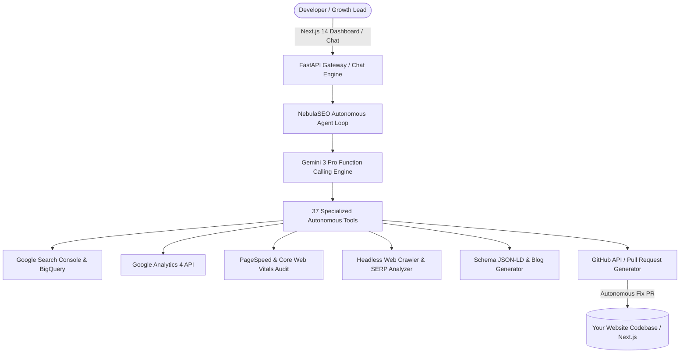

# NebulaSEO — Autonomous AI SEO & Growth Engineering Agent

[](https://opensource.org/licenses/gpl-3.0)
[](https://www.python.org/downloads/)
[](https://nextjs.org)
[](https://fastapi.tiangolo.com)
[](CONTRIBUTING.md)

> **NebulaSEO** is an end-to-end autonomous AI SEO agent and real-time observability platform. Powered by Gemini 3 Pro with **37 specialized search and growth engineering tools**, it crawls web pages, audits Core Web Vitals, ingests Google Search Console & GA4 data, and **autonomously creates GitHub Pull Requests** to fix meta tags, structured schema (JSON-LD), and heading architecture directly in your codebase.

---

## 🏛️ Architecture Overview



---

## 🛠️ 37 Autonomous Agent Tools

| Category | Available Tools & Capabilities |
| :--- | :--- |
| **📊 GSC & BigQuery Analytics** | `get_gsc_performance`, `get_top_queries`, `get_top_pages`, `get_country_breakdown`, `get_device_breakdown`, `bigquery_gsc_query` |
| **📈 GA4 Web Analytics** | `get_ga4_realtime_traffic`, `get_ga4_top_landing_pages`, `get_ga4_user_acquisition`, `get_ga4_conversion_events` |
| **⚡ Core Web Vitals & Speed** | `pagespeed_audit`, `core_web_vitals_crux`, `mobile_usability_check`, `lighthouse_performance_score` |
| **🔍 SERP & Competitor Intelligence**| `analyze_serp_features`, `compare_competitors_serp`, `keyword_opportunity_scanner`, `competitor_backlink_profile` |
| **🕷️ Web Crawling & Scraping** | `fetch_page_content`, `parse_sitemap_xml`, `extract_heading_hierarchy`, `validate_robots_txt` |
| **🏷️ Structured Schema & Content** | `generate_schema_markup` (Organization, Service, FAQ, Product, Article), `generate_meta_tags`, `generate_blog_outline` |
| **🤖 Autonomous Codebase Fixes** | `list_repo_files`, `read_repo_file`, `update_meta_tags_pr`, `inject_schema_pr`, `fix_heading_structure_pr`, `create_pull_request` |

---

## 🚀 Quickstart

### Option A: 1-Command Docker Compose

```bash
git clone https://github.com/Vmnebula/NebulaSeo.git
cd agents

# Configure environment
cp .env.example .env
# Edit .env with your GEMINI_API_KEY and GITHUB_TOKEN

# Launch Agent Backend + Next.js Dashboard
docker compose up --build
```

- **Dashboard UI:** `http://localhost:3000`
- **FastAPI Agent API:** `http://localhost:8080`
- **API Docs (Swagger):** `http://localhost:8080/docs`

---

### Option B: Local Manual Setup

#### 1. Start Agent Backend (FastAPI)
```bash
cd agent
python3 -m venv venv
source venv/bin/activate
pip install -r requirements.txt

cp .env.example .env
python main.py
```

#### 2. Start Dashboard Frontend (Next.js 14)
```bash
cd ../dashboard
npm install
npm run dev
```

---

## 🔧 Autonomous Codebase Fixes (GitHub Integration)

When you ask NebulaSEO to optimize a page:
1. It crawls the live target URL and calculates its Lighthouse & Schema score.
2. Identifies missing OpenGraph tags, schema JSON-LD, or heading violations.
3. Clones the associated file from your repository via GitHub API.
4. Generates an optimized AST-safe patch.
5. Pushes a new branch and **opens a ready-to-merge Pull Request**.

---

## 🤝 Contributing

We welcome community contributions! Please see [CONTRIBUTING.md](CONTRIBUTING.md) for details on adding new tool integrations.

---

## 📄 License

Distributed under the **GNU General Public License v3.0 (GPLv3)**. See [`LICENSE`](LICENSE) for more information.
